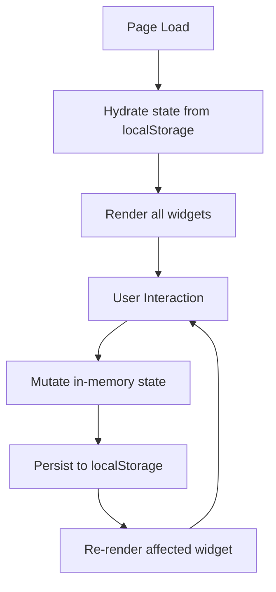

# Design Document: Personal Dashboard

## Overview

The Personal Dashboard is a single-page web application delivered as three static files: `index.html`, `css/style.css`, and `js/app.js`. It requires no build step and runs directly in any modern browser. The app provides four widgets — a live greeting, a Pomodoro-style focus timer, a to-do list, and a quick-links panel — with task and link data persisted in `localStorage`.

The design prioritises simplicity: no frameworks, no bundlers, no external dependencies. All state lives in memory during a session and is synchronised to `localStorage` on every mutation.

---

## Architecture

The application follows a straightforward **data → render** pattern:

1. On page load, state is hydrated from `localStorage`.
2. User interactions mutate in-memory state.
3. After every mutation, the affected state slice is serialised back to `localStorage` and the relevant DOM section is re-rendered.

There is no virtual DOM or reactive framework. Each widget owns a `render()` function that rebuilds its DOM subtree from the current state object.



### Module Boundaries (within `js/app.js`)

Although everything lives in one file, the code is organised into logical sections separated by comments:

| Section | Responsibility |
|---|---|
| `STATE` | Single source-of-truth object holding tasks, links, and timer state |
| `STORAGE` | `loadState()` / `saveState()` helpers wrapping `localStorage` |
| `GREETING` | Clock tick, date formatting, greeting message logic |
| `TIMER` | Countdown logic, interval management, control handlers |
| `TODO` | Task CRUD, validation, render |
| `LINKS` | Link CRUD, validation, render |
| `INIT` | Bootstraps all widgets on `DOMContentLoaded` |

---

## Components and Interfaces

### Greeting Widget

**DOM target:** `#greeting-widget`

| Element | Role |
|---|---|
| `#clock` | Displays HH:MM:SS, updated every second via `setInterval` |
| `#date-display` | Displays human-readable date |
| `#greeting-message` | Displays "Good Morning / Afternoon / Evening" |

**Key function:**
```
tickClock() → void
  - reads new Date()
  - formats time as HH:MM:SS
  - formats date as Weekday, Month D YYYY
  - derives greeting from hour
  - writes to DOM
```

Called once immediately on init, then every 1 000 ms via `setInterval`.

---

### Focus Timer Widget

**DOM target:** `#timer-widget`

| Element | Role |
|---|---|
| `#timer-display` | Shows remaining time as MM:SS |
| `#btn-start` | Starts the countdown |
| `#btn-stop` | Pauses the countdown |
| `#btn-reset` | Resets to 25:00 |

**State slice:**
```
timer: {
  remaining: number,   // seconds remaining (0–1500)
  running: boolean,    // whether interval is active
  intervalId: number | null
}
```

**Key functions:**
```
startTimer() → void   // sets interval, sets running = true
stopTimer()  → void   // clears interval, sets running = false
resetTimer() → void   // calls stopTimer(), sets remaining = 1500
tickTimer()  → void   // decrements remaining; stops at 0
formatTime(seconds: number) → string  // "MM:SS"
```

Timer state is **not** persisted to `localStorage` (a timer mid-session has no meaningful value after a page reload).

---

### To-Do List Widget

**DOM target:** `#todo-widget`

| Element | Role |
|---|---|
| `#todo-input` | Text input for new task description |
| `#btn-add-task` | Submits new task (also triggered by Enter key) |
| `#todo-error` | Inline validation message (hidden by default) |
| `#task-list` | `<ul>` containing rendered task items |

Each task item renders as:
```html
<li data-id="{id}">
  <input type="checkbox" checked?={done}>
  <span class="task-text {done ? 'done' : ''}">…</span>
  <button class="btn-edit">Edit</button>
  <button class="btn-delete">Delete</button>
</li>
```

When editing, the `<span>` is replaced with an `<input>` and a Confirm button inline.

**Key functions:**
```
addTask(description: string) → void
editTask(id: string, newDescription: string) → void
toggleTask(id: string) → void
deleteTask(id: string) → void
renderTasks() → void
validateTaskInput(value: string) → boolean
```

---

### Quick Links Widget

**DOM target:** `#links-widget`

| Element | Role |
|---|---|
| `#link-label-input` | Text input for link label |
| `#link-url-input` | Text input for URL |
| `#btn-add-link` | Submits new link |
| `#links-error` | Inline validation message (hidden by default) |
| `#links-list` | Container for rendered link buttons |

Each link renders as:
```html
<div class="link-item" data-id="{id}">
  <a href="{url}" target="_blank" rel="noopener noreferrer">{label}</a>
  <button class="btn-delete-link">×</button>
</div>
```

**Key functions:**
```
addLink(label: string, url: string) → void
deleteLink(id: string) → void
renderLinks() → void
validateLinkInput(label: string, url: string) → boolean
```

---

## Data Models

### Task

```js
{
  id:   string,   // crypto.randomUUID() or Date.now().toString()
  text: string,   // non-empty task description
  done: boolean   // completion state
}
```

Stored in `localStorage` under the key `"pd_tasks"` as a JSON array.

### Link

```js
{
  id:    string,  // crypto.randomUUID() or Date.now().toString()
  label: string,  // non-empty display label
  url:   string   // non-empty URL string
}
```

Stored in `localStorage` under the key `"pd_links"` as a JSON array.

### In-Memory State Object

```js
const state = {
  tasks: Task[],
  links: Link[]
  // timer state is managed separately (not persisted)
};
```

### Storage Helpers

```js
function loadState() {
  // reads "pd_tasks" and "pd_links" from localStorage
  // JSON.parse with try/catch; falls back to [] on error or absence
  // returns { tasks: Task[], links: Link[] }
}

function saveTasks() {
  localStorage.setItem("pd_tasks", JSON.stringify(state.tasks));
}

function saveLinks() {
  localStorage.setItem("pd_links", JSON.stringify(state.links));
}
```

---

## Correctness Properties

*A property is a characteristic or behavior that should hold true across all valid executions of a system — essentially, a formal statement about what the system should do. Properties serve as the bridge between human-readable specifications and machine-verifiable correctness guarantees.*

### Property 1: Time formatting is always valid HH:MM:SS

*For any* `Date` object, the time-formatting function SHALL produce a string matching `HH:MM:SS` where HH is the zero-padded hour (00–23), MM is the zero-padded minute (00–59), and SS is the zero-padded second (00–59).

**Validates: Requirements 1.1**

---

### Property 2: Date formatting always contains weekday, month, day, and year

*For any* `Date` object, the date-formatting function SHALL produce a string that contains a valid English weekday name, a valid English month name, the correct day-of-month number, and the correct 4-digit year.

**Validates: Requirements 1.2**

---

### Property 3: Greeting is determined solely by hour

*For any* integer hour in [0, 23], the greeting function SHALL return exactly one of "Good Morning" (hours 5–11), "Good Afternoon" (hours 12–17), or "Good Evening" (hours 18–23 and 0–4), with no other values possible.

**Validates: Requirements 1.3, 1.4, 1.5**

---

### Property 4: Timer display is always valid MM:SS

*For any* integer number of seconds in [0, 1500], `formatTime(seconds)` SHALL produce a string matching `MM:SS` where MM is the zero-padded minutes and SS is the zero-padded remaining seconds, and the total represented time equals the input.

**Validates: Requirements 2.3**

---

### Property 5: Timer reset always restores initial state

*For any* timer state (any value of `remaining` in [0, 1500], any value of `running`), calling `resetTimer()` SHALL result in `remaining === 1500` and `running === false`.

**Validates: Requirements 2.5**

---

### Property 6: Adding a valid task always grows the list by one

*For any* task list and any non-empty, non-whitespace-only string description, calling `addTask(description)` SHALL increase the task list length by exactly 1 and the new task's `text` SHALL equal the trimmed description.

**Validates: Requirements 3.1**

---

### Property 7: Whitespace-only input is always rejected

*For any* string composed entirely of whitespace characters (spaces, tabs, newlines), both `validateTaskInput(value)` and `validateLinkInput(label, url)` (when the whitespace string is used as label or URL) SHALL return `false`, and the respective list SHALL remain unchanged.

**Validates: Requirements 3.2, 3.5, 4.2**

---

### Property 8: Editing a task with valid input always updates its text

*For any* task in the list and any non-empty, non-whitespace-only replacement string, calling `editTask(id, newText)` SHALL update that task's `text` to the new value while leaving all other tasks and the `done` state unchanged.

**Validates: Requirements 3.4**

---

### Property 9: Toggling a task twice restores its original state

*For any* task with any `done` value, calling `toggleTask(id)` twice in succession SHALL result in the task's `done` value being identical to its value before either toggle was applied.

**Validates: Requirements 3.6**

---

### Property 10: Deleting a task removes exactly that task

*For any* non-empty task list and any task `id` present in the list, calling `deleteTask(id)` SHALL reduce the list length by exactly 1 and no task with that `id` SHALL remain in the list; all other tasks SHALL be unchanged.

**Validates: Requirements 3.7**

---

### Property 11: Persistence round-trip preserves tasks and links

*For any* array of tasks and any array of links, serialising them to `localStorage` via `saveTasks()` / `saveLinks()` and then deserialising via `loadState()` SHALL produce arrays that are deeply equal to the originals (same order, same field values).

**Validates: Requirements 3.8, 4.5, 5.3**

---

### Property 12: Completed tasks are visually distinguished

*For any* task list containing tasks with mixed `done` states, after `renderTasks()` each rendered task element SHALL have the `done` CSS class applied if and only if the corresponding task's `done` field is `true`.

**Validates: Requirements 3.9**

---

### Property 13: Adding a valid link always grows the list by one

*For any* links list and any non-empty label string and non-empty URL string, calling `addLink(label, url)` SHALL increase the links list length by exactly 1 and the new link's `label` and `url` SHALL equal the provided values.

**Validates: Requirements 4.1**

---

### Property 14: Deleting a link removes exactly that link

*For any* non-empty links list and any link `id` present in the list, calling `deleteLink(id)` SHALL reduce the list length by exactly 1 and no link with that `id` SHALL remain in the list; all other links SHALL be unchanged.

**Validates: Requirements 4.4**

---

### Property 15: Malformed or absent localStorage data always falls back to empty arrays

*For any* value stored under `"pd_tasks"` or `"pd_links"` that is absent, `null`, or not valid JSON representing an array, `loadState()` SHALL return an empty array for the affected key and SHALL NOT throw an exception.

**Validates: Requirements 5.4**

---

## Error Handling

### Input Validation

- **Empty / whitespace task description**: `validateTaskInput` trims the value and returns `false` if the result is empty. The `#todo-error` element is made visible with a message such as "Task description cannot be empty." The input field retains focus.
- **Empty label or URL for a link**: `validateLinkInput` checks both fields after trimming. If either is empty, `#links-error` is shown with an appropriate message.
- **Edit confirmation with empty text**: `editTask` re-validates before applying the update. If validation fails, the task text is left unchanged and the edit input shows an error state.

### localStorage Errors

- `loadState` wraps both `JSON.parse` calls in `try/catch`. Any parse error or missing key results in an empty array for that data type. The app continues loading normally.
- `saveTasks` and `saveLinks` do not wrap writes in `try/catch` by default (storage quota errors are rare in practice for this data volume), but the design allows adding error handling here if needed.

### Timer Boundary

- `tickTimer` checks `remaining <= 0` before decrementing. When `remaining` reaches 0, the interval is cleared and `running` is set to `false`. The display is set to `"00:00"`.

### DOM Safety

- All event listeners are attached after `DOMContentLoaded`.
- `renderTasks` and `renderLinks` clear their container's `innerHTML` before re-rendering, preventing duplicate elements.

---

## Testing Strategy

### Approach

The testing strategy uses a **dual approach**:

1. **Property-based tests** for universal correctness properties (Properties 1–15 above).
2. **Example-based unit tests** for specific scenarios, edge cases, and integration points.

### Property-Based Testing

**Library:** [fast-check](https://github.com/dubzzz/fast-check) (JavaScript, runs in Node.js with any test runner).

**Test runner:** [Vitest](https://vitest.dev/) (zero-config, ESM-friendly, no build step required for the source files under test — the pure logic functions are extracted and tested in isolation).

**Configuration:** Each property test runs a minimum of **100 iterations** (fast-check default is 100; increase to 1000 for critical properties).

**Tag format:** Each property test is annotated with a comment:
```
// Feature: personal-dashboard, Property N: <property_text>
```

**Properties to implement as property-based tests:**

| Property | fast-check Arbitraries |
|---|---|
| 1 — Time formatting | `fc.date()` |
| 2 — Date formatting | `fc.date()` |
| 3 — Greeting by hour | `fc.integer({ min: 0, max: 23 })` |
| 4 — Timer display | `fc.integer({ min: 0, max: 1500 })` |
| 5 — Timer reset | `fc.record({ remaining: fc.integer({min:0,max:1500}), running: fc.boolean() })` |
| 6 — Add valid task | `fc.array(taskArb), fc.string({ minLength: 1 }).filter(s => s.trim().length > 0)` |
| 7 — Whitespace rejected | `fc.stringOf(fc.constantFrom(' ', '\t', '\n'))` |
| 8 — Edit task | `fc.array(taskArb), fc.string({ minLength: 1 }).filter(s => s.trim().length > 0)` |
| 9 — Toggle round-trip | `fc.record({ id: fc.uuid(), text: fc.string(), done: fc.boolean() })` |
| 10 — Delete task | `fc.array(taskArb, { minLength: 1 })` |
| 11 — Persistence round-trip | `fc.array(taskArb), fc.array(linkArb)` |
| 12 — Visual distinction | `fc.array(taskArb)` |
| 13 — Add valid link | `fc.array(linkArb), fc.string({ minLength: 1 }), fc.webUrl()` |
| 14 — Delete link | `fc.array(linkArb, { minLength: 1 })` |
| 15 — Malformed localStorage | `fc.oneof(fc.string(), fc.constant(null), fc.constant(undefined))` |

### Example-Based Unit Tests

- Timer initialises to 1500 seconds with `running === false` (Requirement 2.1)
- `tickTimer()` decrements `remaining` by 1 (Requirement 2.2)
- `stopTimer()` sets `running === false` and preserves `remaining` (Requirement 2.4)
- Timer stops at 0 and does not go negative (Requirement 2.6)
- Edit mode is entered when the Edit button is activated (Requirement 3.3)
- Rendered link elements have `target="_blank"` and correct `href` (Requirement 4.3)
- `index.html` contains exactly one `<link>` to `css/style.css` (Requirement 6.1)
- `index.html` contains exactly one `<script>` pointing to `js/app.js` (Requirement 6.2)

### Test File Location

```
tests/
  greeting.test.js
  timer.test.js
  todo.test.js
  links.test.js
  persistence.test.js
  structure.test.js
```

Pure logic functions (formatters, validators, state mutators) are exported from `js/app.js` using a conditional export pattern so they remain testable without a bundler:

```js
// At the bottom of js/app.js
if (typeof module !== 'undefined') {
  module.exports = { formatTime, getGreeting, formatDate, validateTaskInput, ... };
}
```
